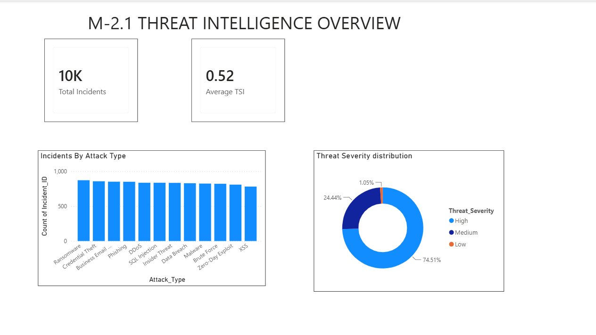
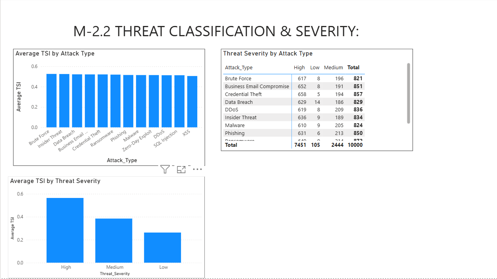
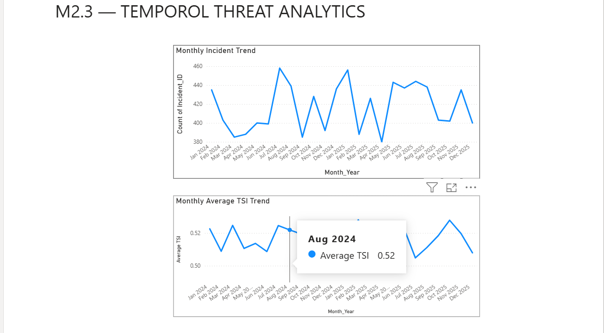
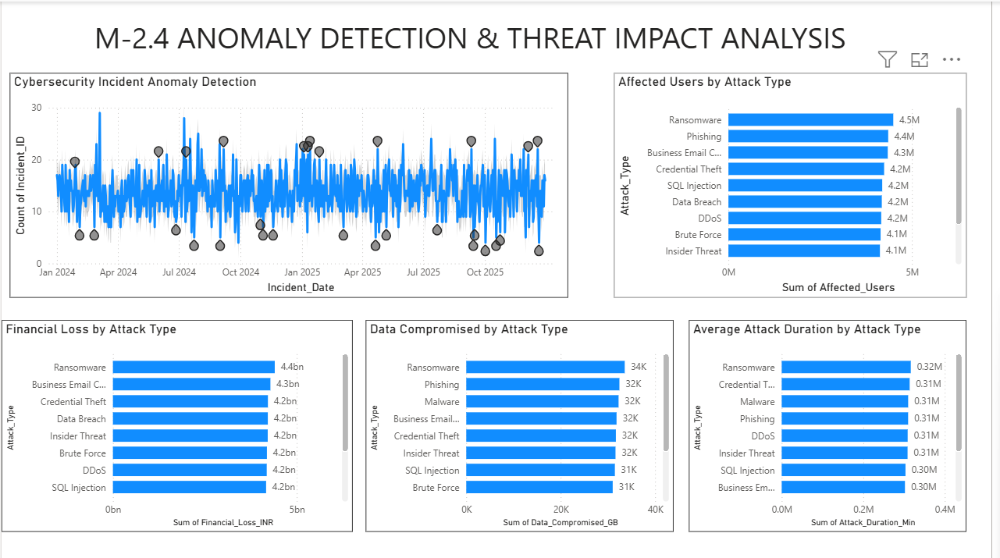

# Milestone 2 — Threat Intelligence & Temporal Analytics

## Overview

Milestone 2 focuses on **Threat Intelligence & Temporal Analytics** for cybersecurity incidents. The objective is to transform incident-level security data into meaningful threat intelligence by analyzing attack classifications, threat severity, temporal patterns, anomalies, and incident impact.

This milestone was implemented using the **`clean_data`** dataset and Power BI.

---

## Objectives

- Analyze cybersecurity incidents by attack type and threat severity.
- Examine the relationship between attack classifications and Threat Severity Index (TSI).
- Identify temporal trends in incident frequency and threat severity.
- Detect unusual patterns in daily incident activity.
- Analyze the impact of attacks in terms of financial loss, compromised data, affected users, and attack duration.
- Present the findings through interactive Power BI visualizations.

---

## M2 Dashboard Structure

### M2.1 — Threat Intelligence Overview

This page provides a high-level overview of the cybersecurity incident dataset.

**Key Indicators:**
- Total Incidents
- Average Threat Severity Index (TSI)

**Visualizations:**
- Incidents by Attack Type
- Threat Severity Distribution

The page provides an initial understanding of the overall threat landscape and severity composition.

---

### M2.2 — Threat Classification & Severity

This page analyzes cybersecurity threats by classification and severity.

**Visualizations:**
- Average TSI by Attack Type
- Threat Severity by Attack Type
- Average TSI by Threat Severity

The analysis helps identify differences in threat severity across attack types and examines how attack classifications are distributed across High, Medium, and Low threat-severity categories.

---

### M2.3 — Temporal Threat Analysis

This page focuses on how cybersecurity incidents and threat severity change over time.

**Visualizations:**
- Monthly Incident Trend
- Monthly Average TSI Trend

The monthly incident trend shows changes in incident volume over the analysis period, while the monthly TSI trend shows changes in average threat severity.

---

### M2.4 — Anomaly Detection & Threat Impact Analysis

This page combines anomaly detection with incident-impact analysis.

**Visualizations:**
- Cybersecurity Incident Anomaly Detection
- Financial Loss by Attack Type
- Data Compromised by Attack Type
- Affected Users by Attack Type
- Average Attack Duration by Attack Type

Power BI anomaly detection is used to identify unusual patterns in daily incident volume.

The impact analysis evaluates attacks using multiple dimensions:
- Financial impact
- Data impact
- User impact
- Attack duration

---

## Threat Intelligence Analysis

The analysis uses the following key fields from `clean_data`:

| Field | Purpose |
|---|---|
| `Attack_Type` | Classifies the type of cyberattack |
| `Threat_Severity` | Represents threat severity |
| `TSI_Score` | Measures overall threat severity |
| `Timestamp` | Supports temporal analysis |
| `Financial_Loss_INR` | Measures financial impact |
| `Data_Compromised_GB` | Measures data impact |
| `Affected_Users` | Measures user impact |
| `Attack_Duration_Min` | Measures attack duration |

---

## Anomaly Detection

Daily incident counts were analyzed using Power BI's built-in anomaly detection capability.

**Configuration:**
- Time field: `Incident_Date`
- Metric: Count of `Incident_ID`
- Sensitivity: 80%
- Expected Range: Enabled

The detected anomalies represent **unusual incident-volume patterns** and should not be interpreted automatically as confirmed cyberattacks.

---

## Key Findings

- The dataset contains approximately **10,000 cybersecurity incidents**.
- The overall average TSI is approximately **0.52**.
- Threat severity is distributed across High, Medium, and Low categories.
- Attack types show relatively similar incident volumes, while their average TSI values vary.
- Monthly incident volumes fluctuate over time.
- Monthly average TSI remains within a relatively narrow range.
- Several unusual daily incident-volume points were identified through anomaly detection.
- Ransomware and other attack categories contribute to significant financial, data, and user impacts.
- Attack duration provides an additional dimension for understanding the operational impact of different attack types.

---

## Environmental Correlation Analysis

The reference requirements include **Environmental Correlation Analysis** as part of Milestone 2.

However, the current implementation uses only the `clean_data` dataset, which does not contain environmental or weather-related variables. Therefore, environmental correlation analysis was **not artificially added** to the dashboard.

Future implementation can incorporate appropriate environmental variables if such data becomes available.

---

## Tools & Technologies

- **Power BI** — Dashboard development and visualization
- **DAX** — Calculated columns and analytical measures
- **Python / Data Processing** — Data preparation
- **Clean Cybersecurity Incident Dataset** — Primary analytical dataset

---

## Dashboard Screenshots

### M2.1 — Threat Intelligence Overview

### M2.2 — Threat Classification & Severity

### M2.3 — Temporal Threat Analysis

### M2.4 — Anomaly Detection & Threat Impact Analysis

---

## Milestone 2 Outcome

Milestone 2 delivers a Power BI-based **Threat Intelligence & Temporal Analytics framework** capable of analyzing cybersecurity incidents across:

- Threat classification
- Threat severity
- Threat Severity Index (TSI)
- Temporal trends
- Anomalous incident activity
- Financial impact
- Data compromise
- Affected users
- Attack duration

The resulting analytics provide a structured view of the cybersecurity threat landscape and establish the analytical foundation for subsequent security risk and executive-level analysis.

---

## Reference

The milestone structure and requirements are based on the project reference document, **Advanced Threat Incident Analytics and Security Visualization Framework**. 
