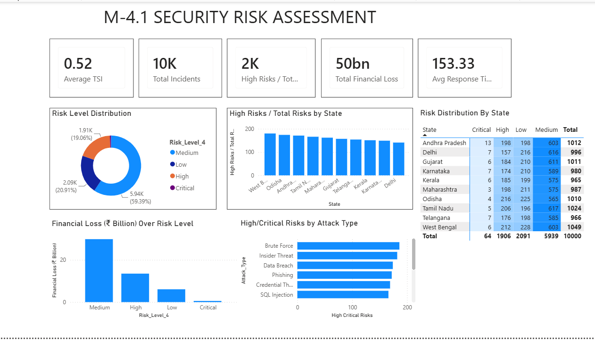
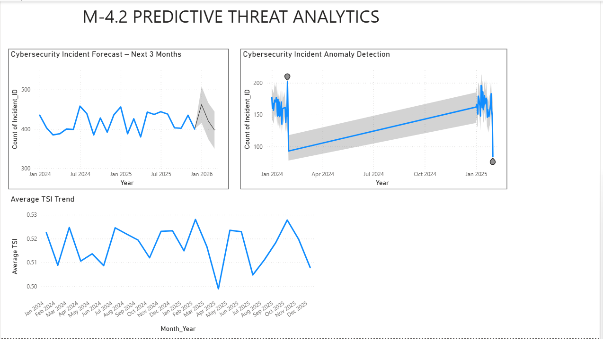
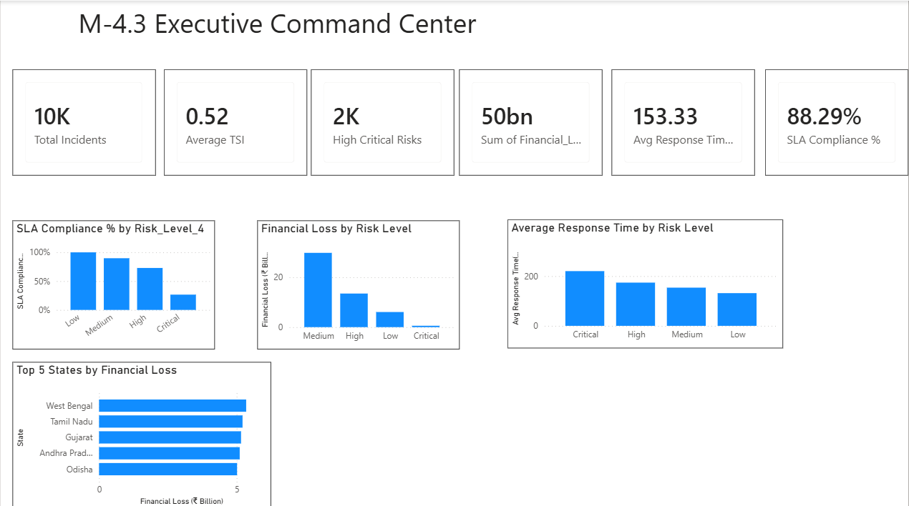
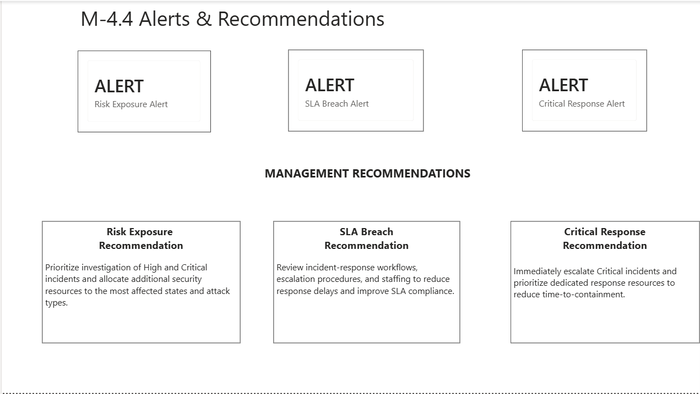

# Milestone 4 — Risk Intelligence & Executive Analytics

Milestone 4 extends the cybersecurity analytics framework from incident analysis to risk intelligence, predictive analytics, executive monitoring, and decision support.

## Objectives

- Perform security risk assessment using the Threat Severity Index (TSI)
- Classify incidents into four risk levels
- Identify High and Critical risk concentrations
- Analyze financial exposure by risk level
- Monitor incident response performance
- Implement risk-based SLA monitoring
- Forecast future incident activity
- Detect unusual incident periods
- Develop executive-level security analytics
- Generate automated security alerts
- Provide management recommendations

## 1. Security Risk Assessment

The original three-level risk model was extended to four risk levels using the Threat Severity Index (TSI).

| TSI Score | Risk Level | Incidents | Share |
|-----------|------------|-----------|-------|
| < 0.40 | Low | 2,091 | 20.91% |
| 0.40 – 0.649 | Medium | 5,939 | 59.39% |
| 0.65 – 0.849 | High | 1,906 | 19.06% |
| ≥ 0.85 | Critical | 64 | 0.64% |

High + Critical incidents account for **19.70%** of the analyzed incidents.

> Risk thresholds are project-defined analytical thresholds.

## 2. Risk Intelligence Analysis

The dashboard analyzes security risk across:

- High/Critical incidents by state
- High/Critical incidents by attack type
- Financial loss by risk level
- Risk distribution by state
- Overall risk-level distribution

These analyses help identify areas requiring greater investigation and security-resource prioritization.

## 3. Executive Command Center

The Executive Command Center provides a high-level view of the security posture through key performance indicators.

### Key Metrics

- Total Incidents: **10,000**
- Average TSI: **0.52**
- High/Critical Risks: **1,970**
- Total Financial Loss: **~₹50B**
- Average Response Time: **153.33 minutes**
- SLA Compliance: **88.29%**

## 4. Risk-Based SLA Monitoring

Risk-specific response targets were implemented instead of using a single response-time target for every incident.

| Risk Level | SLA Target |
|------------|------------|
| Critical | ≤ 180 minutes |
| High | ≤ 240 minutes |
| Medium | ≤ 270 minutes |
| Low | ≤ 300 minutes |

Overall SLA compliance is **88.29%**.

Critical incidents have an average response time of approximately **220 minutes**, exceeding the project-defined Critical SLA target of 180 minutes.

> SLA targets are project-defined analytical targets.

## 5. Predictive Threat Analytics

### Incident Forecasting

Power BI time-series forecasting was used to estimate incident volume for the next three months.

### Forecast Configuration

- Forecast horizon: **3 months**
- Confidence interval: **95%**
- Seasonality: **Auto**
- Input: **Monthly incident counts**

The forecast indicates a declining incident-volume trend, while the confidence interval indicates uncertainty in the predicted values.

### Business Applications

- Security resource planning
- Incident-response workload planning
- Operational preparedness
- Proactive decision-making

## 6. Anomaly Detection & TSI Trend

Power BI anomaly detection identified two unusual periods in incident volume:

- **Early 2024:** Unusually high incident activity
- **Early 2025:** Unusually low incident activity

Average TSI remained approximately between **0.50 and 0.53**, with periodic fluctuations and no strong long-term increase or decrease.

> Anomaly detection identifies unusual time-series behavior and does not by itself determine the underlying cause.

## 7. Automated Security Alerts

Three project-defined alert conditions were implemented.

### Risk Exposure Alert

**Condition:** High + Critical incidents > 15% of total incidents

**Current:** 19.70%

**Status:** ALERT

### SLA Breach Alert

**Condition:** SLA compliance < 90%

**Current:** 88.29%

**Status:** ALERT

### Critical Response Alert

**Condition:** Critical average response time > 180 minutes

**Current:** ~220 minutes

**Status:** ALERT

> Alert thresholds are project-defined analytical thresholds.

## 8. Management Recommendations

Based on the identified risk and response-performance conditions:

### 1. Prioritize High/Critical Incidents
Prioritize investigation of High and Critical incidents and allocate additional resources to the most affected states and attack types.

### 2. Improve Response Performance
Review incident-response workflows, escalation procedures, and staffing to reduce response delays and improve SLA compliance.

### 3. Strengthen Critical Escalation
Immediately escalate Critical incidents and prioritize dedicated response resources to reduce time-to-containment.

## Dashboard Screenshots

### Security Risk Assessment

### Predictive Threat Analytics

### Executive Command Center

### Alerts & Recommendations

## Tools & Technologies

- Power BI
- DAX
- Data Analytics
- Data Visualization
- Time-Series Forecasting
- Anomaly Detection
- Threat Severity Index (TSI)

## My Contribution

This is a collaborative academic project. My documented contribution includes the implementation and analysis associated with **Milestone 4 — Risk Intelligence & Executive Analytics**, including:

- Security risk assessment
- Four-level TSI-based risk classification
- Risk intelligence analysis
- Predictive threat analytics
- Anomaly detection
- Executive Command Center
- Risk-based SLA monitoring
- Automated security alerts
- Management recommendations
- Power BI dashboard development

## Project Context

Milestone 4 is part of the larger:

**Advanced Threat Incident Analytics and Security Visualization Framework**

Other milestones and components were developed collaboratively by the project team.

## Status

**Milestone 4 — Completed**
